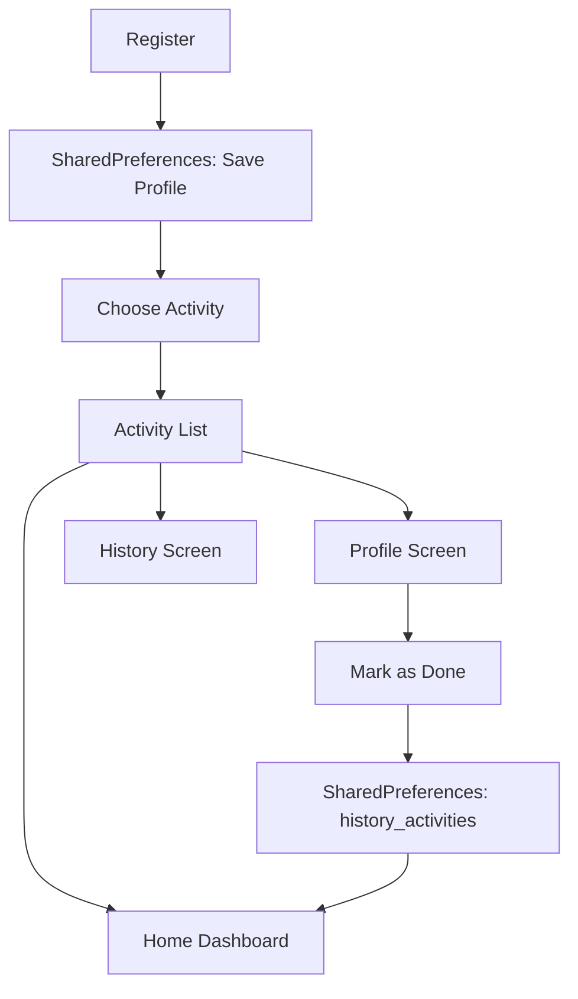

# 🏃‍♂️ Activity Tracker

A lightweight Flutter app for tracking fitness activities like running, walking, swimming, and cycling. It uses local storage to persist user profiles, activities, and avatars.

---

## 📱 Features

- 🔐 Register/Login system (local storage)
- 🎯 Goal and BMI tracking
- 📝 Add/Edit/Delete Activities
- ✅ Mark activities as done
- 📊 Dashboard shows total distance
- 🗂 History of completed activities
- 👤 Profile page with avatar selection from gym-themed assets

---

## 🛠 Technologies Used

| Layer        | Technology                        |
|--------------|------------------------------------|
| Frontend     | Flutter, Dart                      |
| Storage      | SharedPreferences (local storage)  |
| State Mgmt   | Stateful Widgets with `setState()` |
| UI Design    | Material Design                    |
| Assets       | Custom PNG avatars/icons           |

---

## 🧭 App Structure

```
lib/
├── main.dart                    # Entry point
├── home_screen.dart             # Dashboard with distance counters
├── login_screen.dart            # Email/password login
├── register_screen.dart         # Signup form with goal selection
├── profile_screen.dart          # User profile, avatar, activities
├── choose_activity_page.dart    # Activity creation with time & reminder
├── history_screen.dart          # Displays completed activities
├── services/
│   └── local_storage_service.dart  # SharedPreferences logic
├── theme/
│   └── app_theme.dart           # Custom theming (if any)
└── assets/
    └── avatars/                 # Gym-style avatars
```

---

## 🔄 Data Flow

- User profile is stored as a JSON string in SharedPreferences (`user_profile`).
- Activities are saved as a list of JSON objects (`activities`).
- Completed activities are moved to `history_activities`.
- Avatars are selected from predefined images and stored as path (`user_avatar_path`).
- Totals (Running, Cycling, Swimming) are recalculated after each activity update.

---

## 📊 Visual Data Flow Chart



---
## 📸 App Screenshots

| Splash Screen | Login Screen |
|--------------|-----------------|
|  |  |

| Register Screen | Home Screen |
|--------------|-----------------|
|  |  |

| Choose Activity | Select Time |
|-----------------|-------------|
|  |  |

| Profile Page | Activity History |
|--------------|------------------|
|  |  |

---

## 🚀 Getting Started

```bash
git clone https://github.com/yourusername/activity-tracker.git
cd activity-tracker
flutter pub get
flutter run
```

Make sure you add avatar images inside the `/assets/avatars` folder and declare them in `pubspec.yaml`:

```yaml
flutter:
  assets:
    - assets/runner.png
    - assets/dashboard.png
    - assets/avatars/dumbbell.png
    - assets/avatars/barbell.png
    - assets/avatars/yoga.png
    - assets/avatars/runner.png
    - assets/avatars/boxing.png
    - assets/avatars/trainer.png
```

---

## 📄 License

This project is licensed under the MIT License.
